# 🍽️ Recipe Sharing Platform

  
  
  

A **simplified and stylish recipe-sharing web app** built with React, Redux, and Tailwind CSS. Users can browse, search, create, edit, and save their favorite recipes with full CRUD functionality, user authentication, and a sleek UI/UX.

---

## Features

### Core Functionality

- **- Recipe Feed** 
    - Grid/list view of recipes with image, title, cook time, and rating.
    - Search bar for titles or ingredients.
    - Fully responsive with Tailwind CSS.

- **- Recipe Details Page**
    - Ingredients list and cooking instructions.
    - Cooking timer based on cook time.
    - Save to Favorites button.

- **- User Authentication**
    - Login/Signup with client-side validation.
    - Mock authentication using LocalStorage.
    - Protected routes for authenticated users only.

- **- CRUD Operations**
    - Add new recipes with image, title, ingredients & instructions.
    - Update/Delete your own recipes.
    - Form validation using **Formik + Yup**.

- **-  Favorites System**
    - Save or unsave recipes.
    - Access saved recipes from profile.
    - Redux-powered state, persisted in LocalStorage.
- **- Cooking Timer**
    - Interactive countdown timer.
    - Starts from the recipe detail page.

- **- Ingredient Substitutions**
    - Suggestions for alternative ingredients.
    - Shown within recipe details.

- **- Notifications System**
    - Toasts for success/error actions.
    - Uses **React Toastify**.

- **- Advanced Filtering**
    - Filter by dietary needs (e.g., vegan, gluten-free).
    - Combined with title/ingredient search.

- **- Dark Mode**
    - Toggle between Light/Dark themes.
    - Saves preference in LocalStorage.
    - Tailwind CSS + CSS variables powered.

---

##  Tech Stack

| Area             | Tech Used                               |
|------------------|------------------------------------------|
|  Frontend       | React.js                                 |
| Routing         | React Router                             |
| State Management| Redux Toolkit, Redux Thunk               |
|  Styling        | Tailwind CSS, CSS Variables              |

---

## Screenshots
Light & Dark Mode Preview

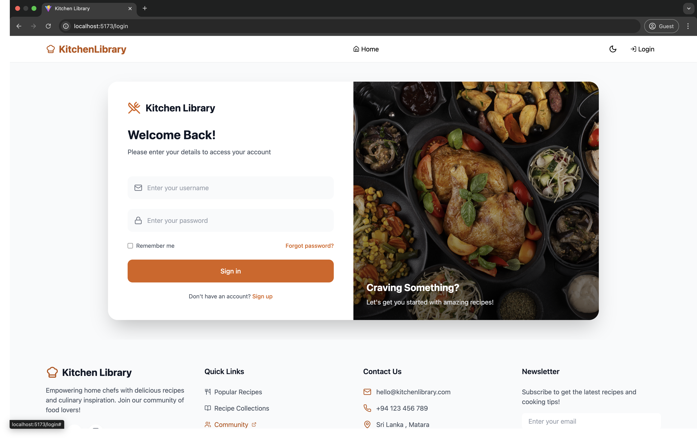
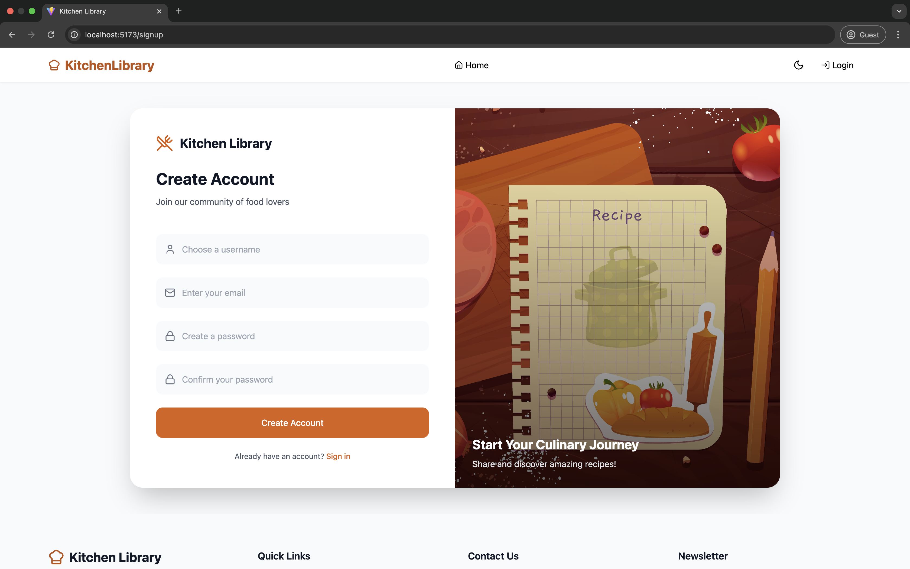
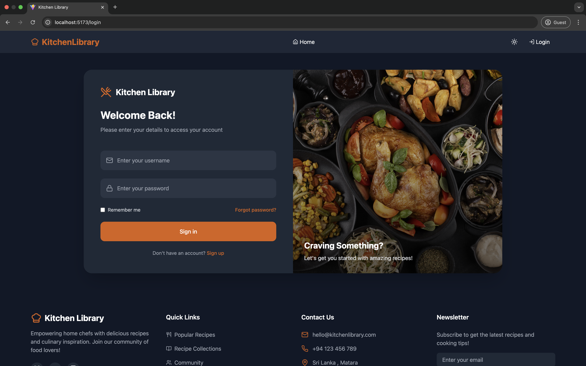
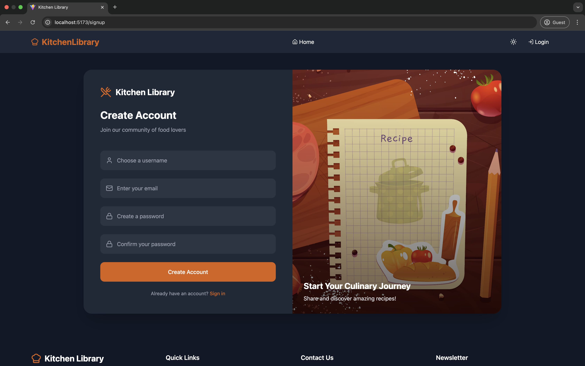
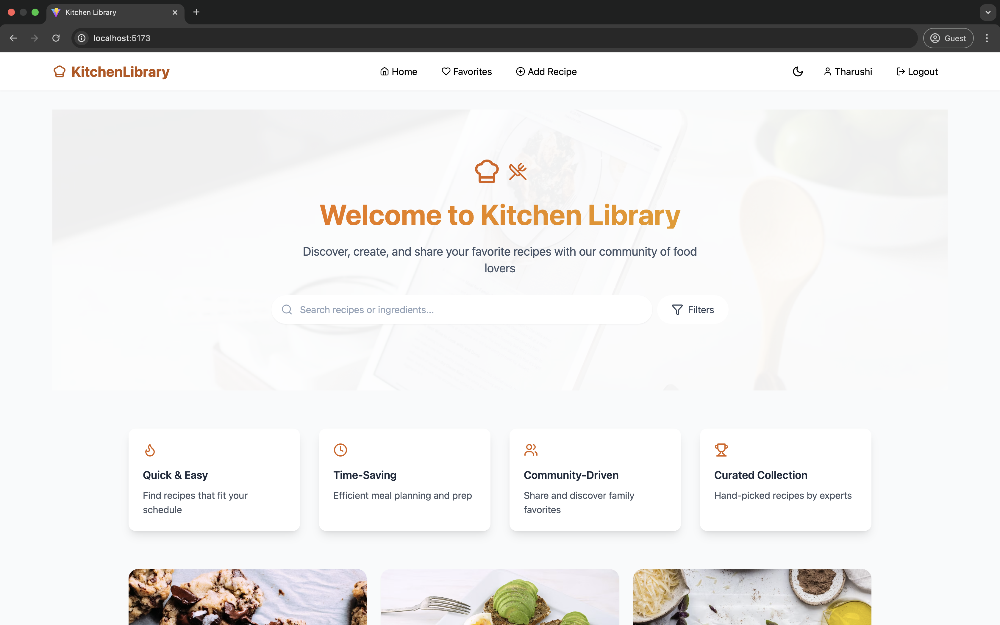
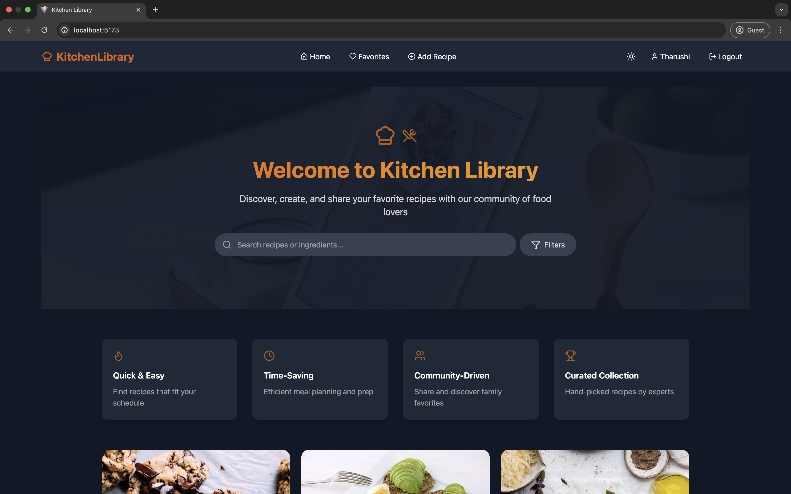

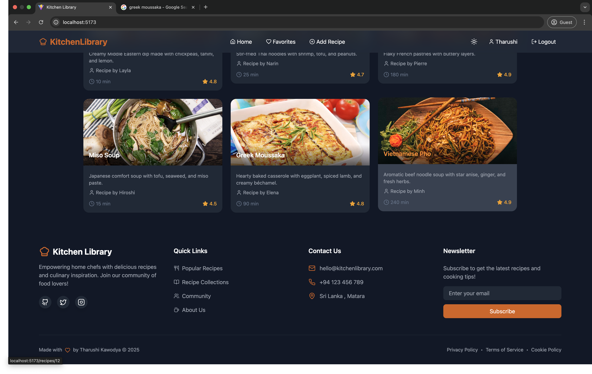
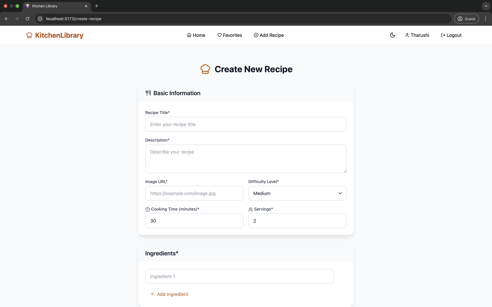
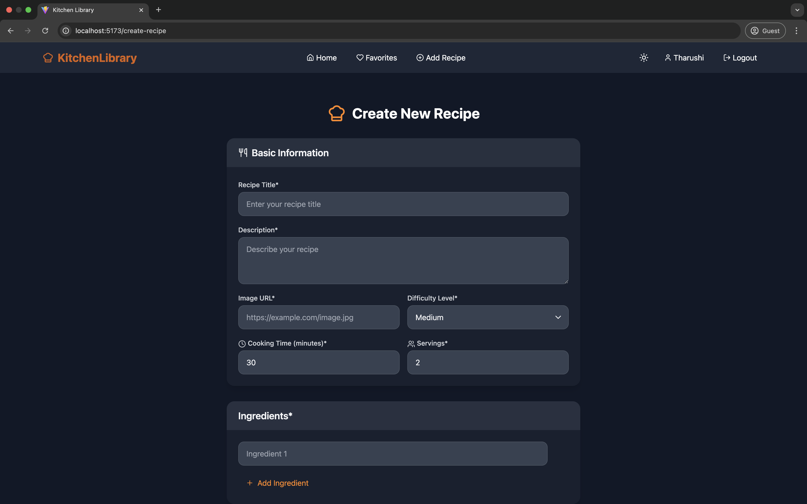
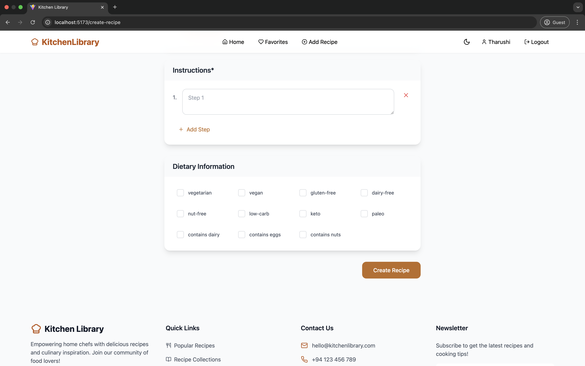
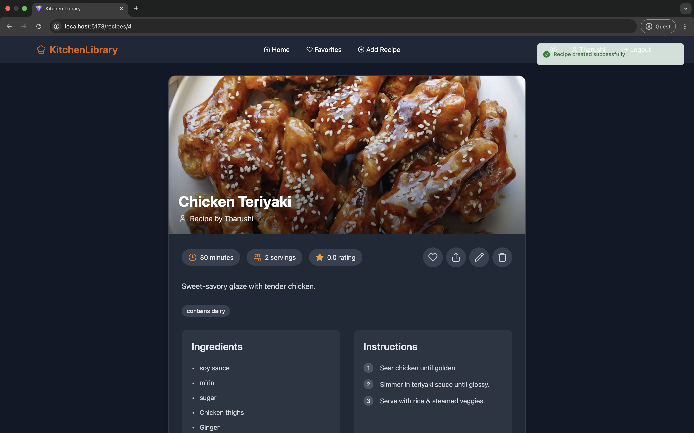
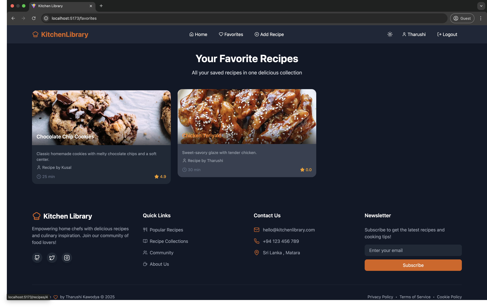
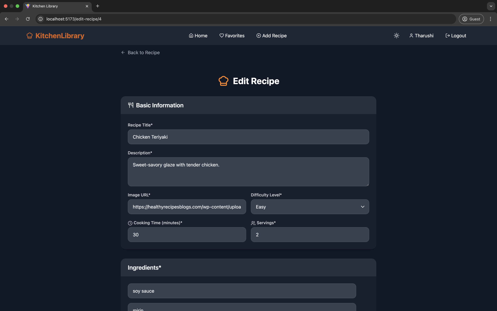
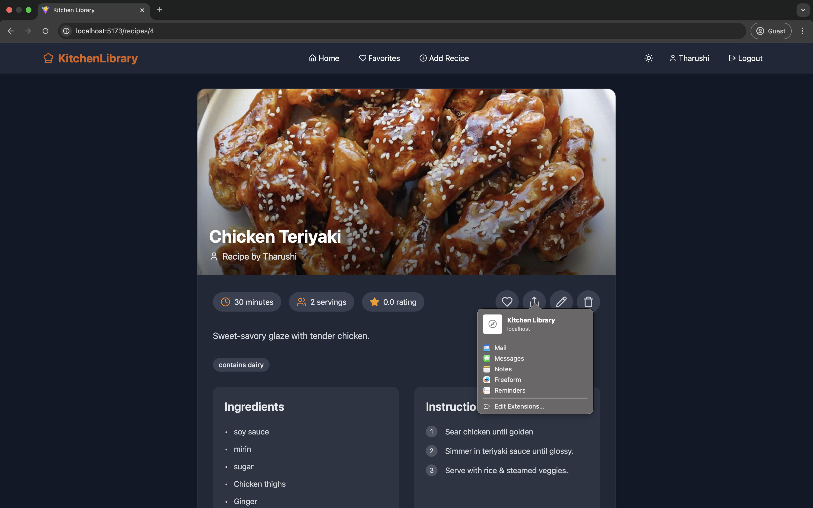
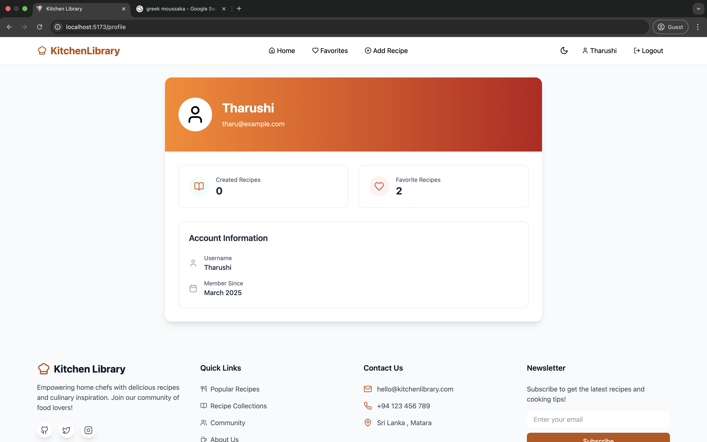
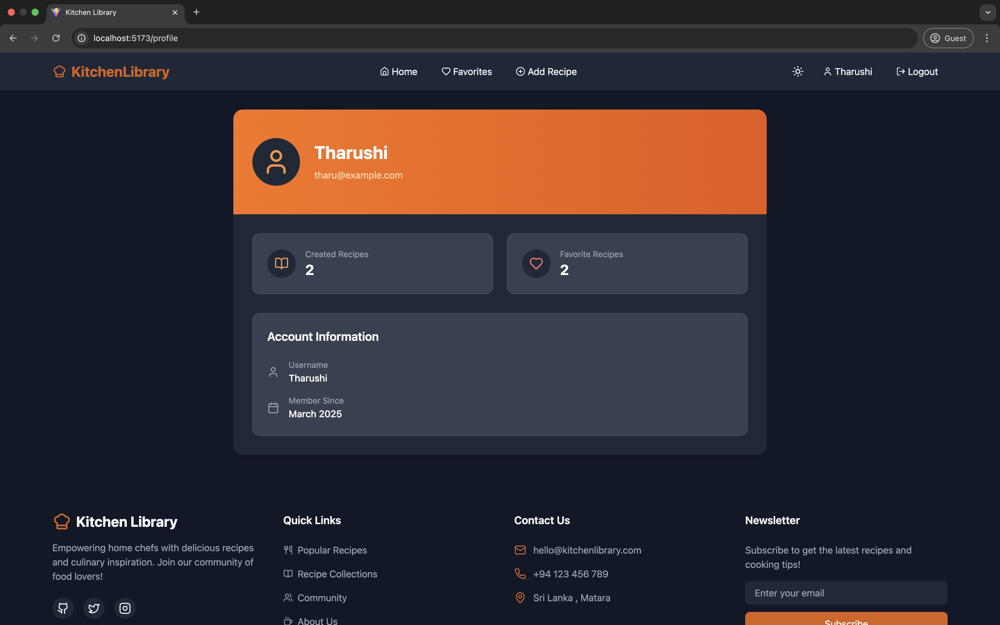

---

## Contributing

Contributions are welcome! Please fork the repository and create a pull request.

---

## License

This project is licensed under the MIT License. See the [LICENSE](LICENSE) file for more details.

